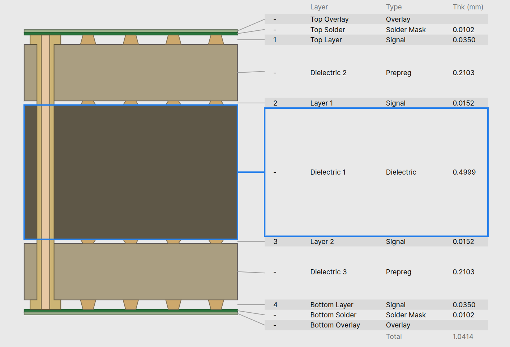
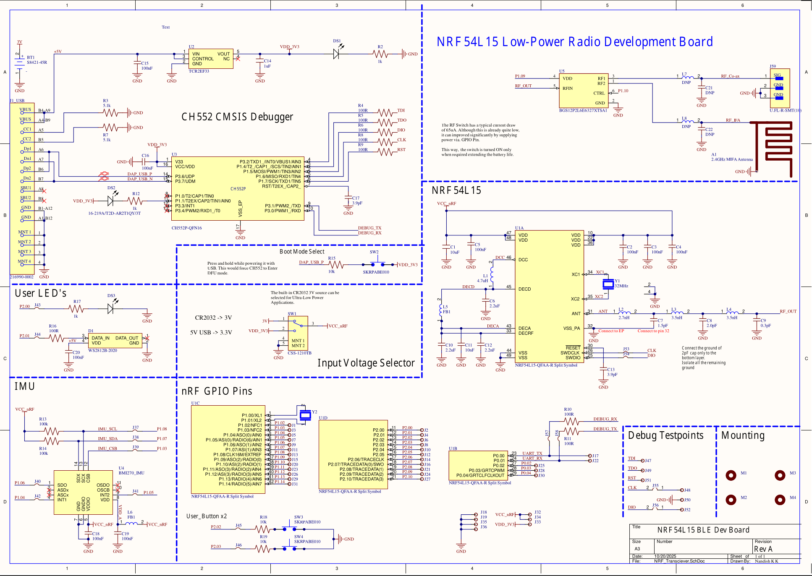
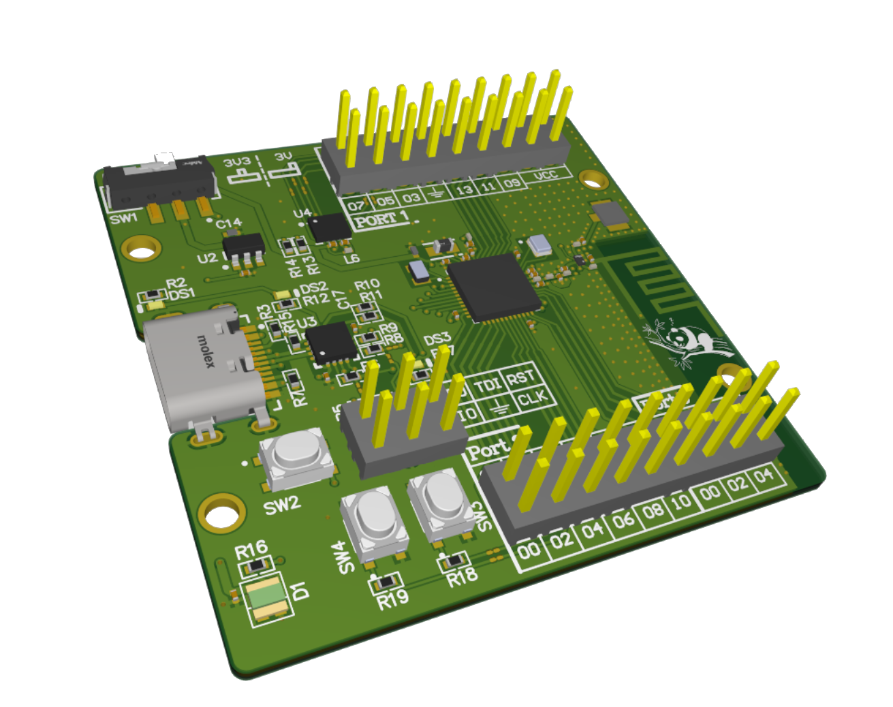
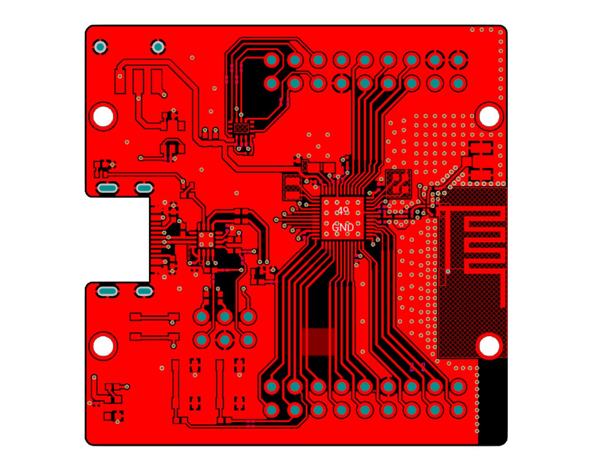
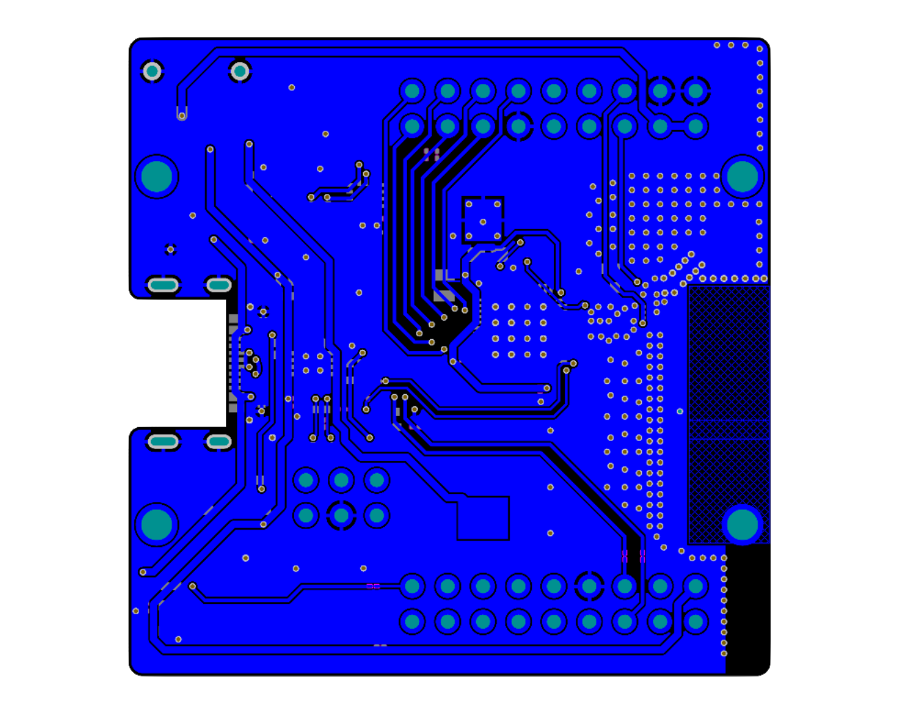
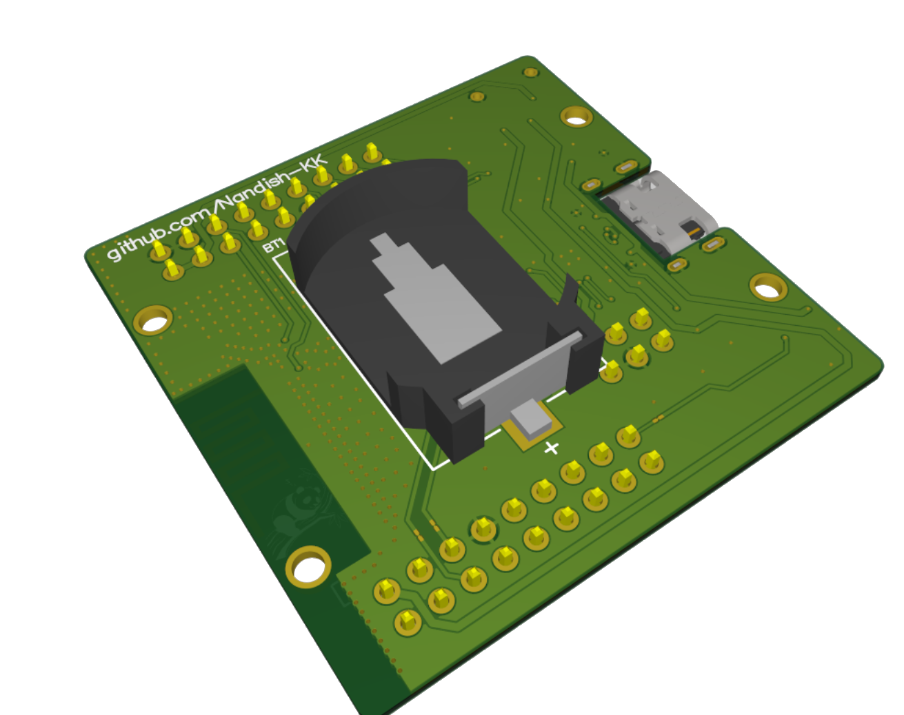

## Overview
This repository contains design files, libraries, and documentation for the NRF BLE transceiver project.
It is **not** an official NRF development board; it is a project I designed as an exercise while learning Altium Designer.


(Renderd with [Blender](https://www.blender.org/) using [*pcb2blender*](https://github.com/30350n/pcb2blender) plugin for KiCAD)

## Things to play around with

- 6-axis IMU (BMI270)
- WS2812 Addressable RGB LED
- Coin cell operation
- Antenna switch for External antenna

## Folder Structure

```text
3D/				  # Contains STEP and Blender files
Altium/           # Altium project files and libraries
Datasheet/        # Datasheets and reference documents
Gerbers/          # Gerbers with PCB constraints optimized for JLCPCB
Pictures/         # Contains Render and Readme pictures
Reference/        # Additional reference layouts and guides
```

## Getting Started

1. Clone the repository:
	```bash
	git clone https://github.com/Nandish-KK/NRF54L15_BLE_DEV
	```
2. Open the Altium project file in `Altium/Nordic_BLE/Nordic_BLE.PrjPcb`.
3. Optionally you can import the Altium project in latest Kicad releases.

## Stackup



JLC04101H-7628

This is a 4-layer stackup with both of the Inner layers being solid ground planes.

## Project Preview

### Schematic


### Top 3D View


### Top Layer


### Bottom Layer


### Bottom 3D View


## Development bugs and fixes
The nrf54 controller comes with `AP_PROTECT` enabled by default. The debuggeres are unable to access the cpu and user flash memory for flashing. In order to unlock the `AP_PROTECT` and get access to the device, the nrf documentation recommends "mass erase". This process will clear the protection registers and allow for flashing.

If your using pyocd inside the nrf-connect terminal with west. During flash it will automatically detect the protection state and will try to erase before flashing. If that doesn't work, try external resets.
```bash
#from the project directory
$ west flash -d build_1/ -r pyocd

# --- OUTPUT ---
-- west flash: rebuilding
[0/5] Performing build step for 'hello_world'
ninja: no work to do.
[4/5] cd /home/user/path/to/project/dir/hello_world/build_1/_sysbuild && /home/user/ncs/toolchains/b2ecd2435d/usr/local/bin/cmake -E true
-- west flash: using runner pyocd
-- runners.pyocd: Flashing file: /media/renri/Hard_disk_Part1/NRF_playground/hello_world/build_1/merged.hex
0000496 W NRF54L15 APPROTECT enabled: will try to unlock via mass erase [target_nRF54L]
0001425 I Loading /home/user/path/to/project/dir/hello_world/build_1/merged.hex [load_cmd]
[==================================================] 100%
0005148 I Erased 36864 bytes (9 sectors), programmed 36864 bytes (9 pages), skipped 0 bytes (0 pages) at 9.75 kB/s [loader]
```

If the protection is enabled, the openenocd 'targets' command will report the main cpu status as unknown as shown below.

```
					 --- Locked State ---
> targets
    TargetName         Type       Endian TapName            State       
--  ------------------ ---------- ------ ------------------ ------------
 0* nrf54l.cpu         cortex_m   little nrf54l.cpu         unknown
 1  nrf54l.aux         mem_ap     little nrf54l.cpu         running


					--- Unlocked State ---
 > targets
    TargetName         Type       Endian TapName            State       
--  ------------------ ---------- ------ ------------------ ------------
 0* nrf54l.cpu         cortex_m   little nrf54l.cpu         running
 1  nrf54l.aux         mem_ap     little nrf54l.cpu         running
````

You can use the following pyocd commands to erase the chip. Although you can connect via openocd, there doesn't seem to be a relibale way to erase the chip with `AP_PROTECT` enabled.
Use the pyocd provided along with the nrf connect or install the latest version of pyocd if you prefere to use it externally. 

```bash
$ pyocd erase --mass --target nrf54l

# --- OUTPUT ---
0000395 W NRF54L15 is not in a secure state [target_nRF54L]
0000608 I Mass erasing device... [eraser]
0001324 I Mass erase complete [eraser]

```
If pyocd command fails to erase/flash with cmsis debugger, try power cycling.


[Working with the nRF52 Series' improved APPROTECT](https://devzone.nordicsemi.com/nordic/nordic-blog/b/blog/posts/working-with-the-nrf52-series-improved-approtect). 

Currently, I don't have J-link at hand. This meant I had to do quite a bit of detective work to come up with a solution. I found the solution in the seedstudio forum discussion on Xiao-nrf54l15. The discussion provides quite a bit of insight on the issues that you might face.
[Xiao-nrf54l15 Memory transfer fault](https://forum.seeedstudio.com/t/xiao-nrf54l15-an-error-occurred-memory-transfer-fault-0x00ffc31c-0x00ffc31f/293792/26?page=2)
[Control access port protection documentation]


## Design Notes

* Hold the Boot button for uploading the CMSIS-DAP firmware for CH552 (first time only)
* Use the toggle switch to select the USB or Coin-cell operation
* The Antenna switch is powered with the GPIO _P1.09 and is controlled by GPIO P1.10; configure GPIOs for proper RF operation.
* Every GPIO used onboard has a bridger solder link. If any project requires these GPIOs externally, simply cut the closed solder bridge trace.

## On-Board Debugger

The Board design utilizes a CH552P microcontroller with a CMSIS-DAP firmware as a built-in debugger for NRF microcontroller. The CH552P is opted mainly due to its low cost and smaller footprint.
If you are designing your own board and would like to have a micro that is available at sites like digikey, mouser etc, then consider the SAMD11 series from microchip. These are fairly optimized for cost and size.

```
This project uses the Debugger implementation from wagiminator's CH552-DAPLink project.
Check out his project at: 

> github.com/wagiminator/CH552-DAPLink
> oshwlab.com/wagiminator/ch552g-daplink

```

## License
This work is licensed under CC BY-SA 4.0.
(https://creativecommons.org/licenses/by-sa/4.0/)


---
