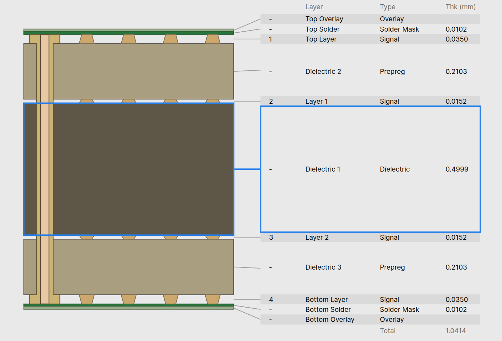
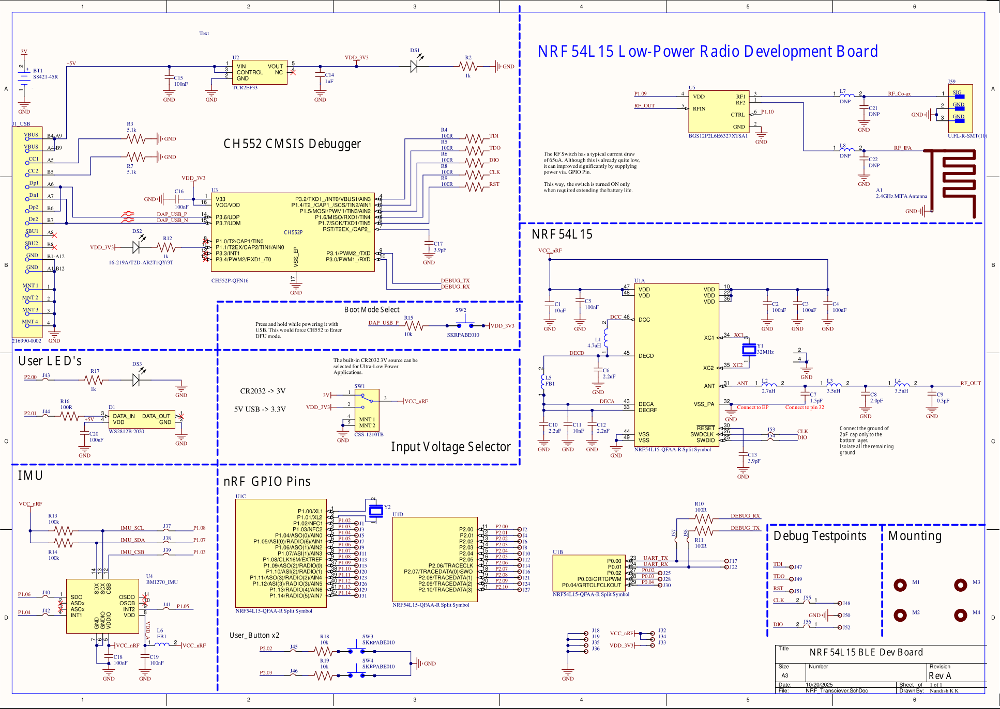
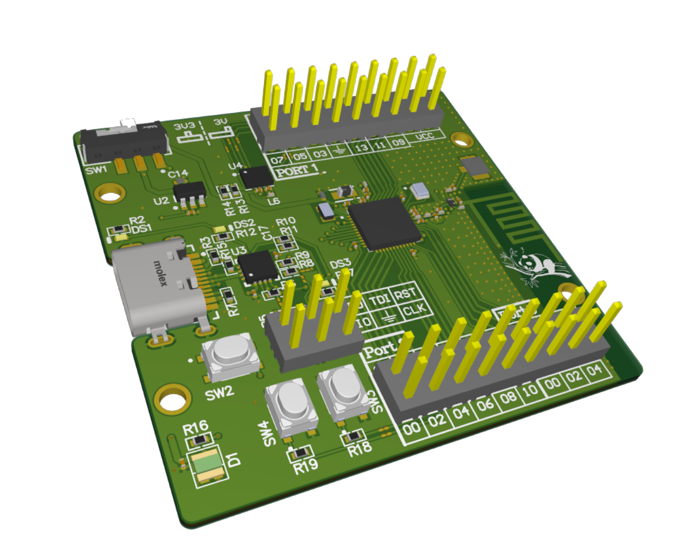
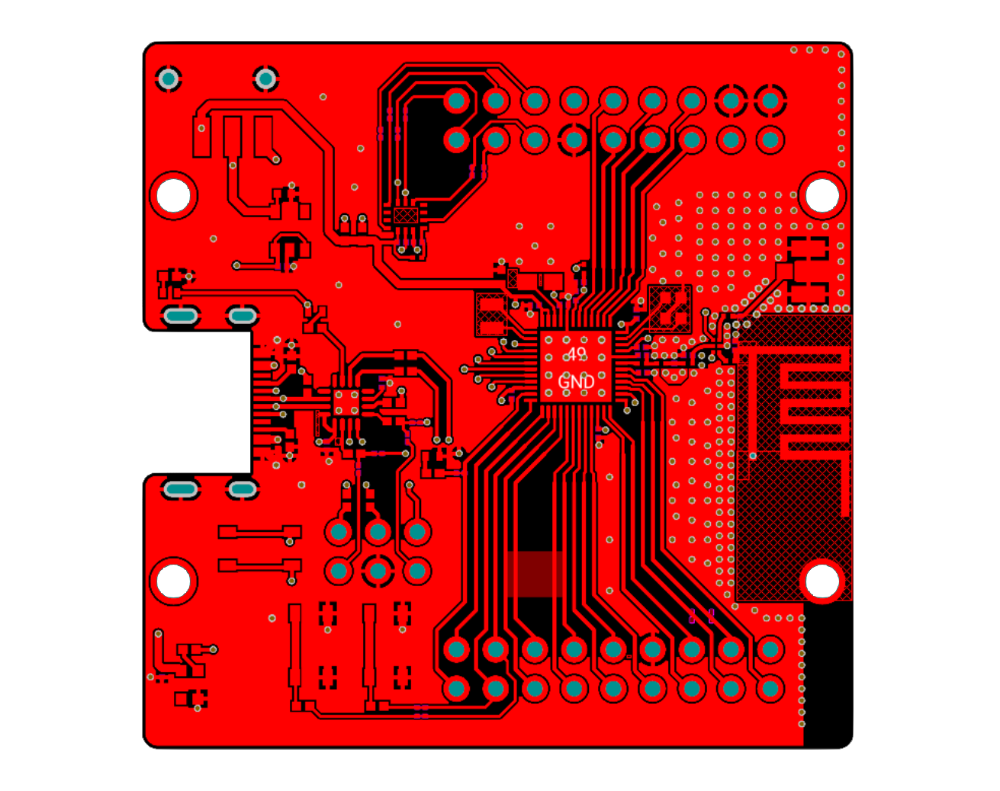
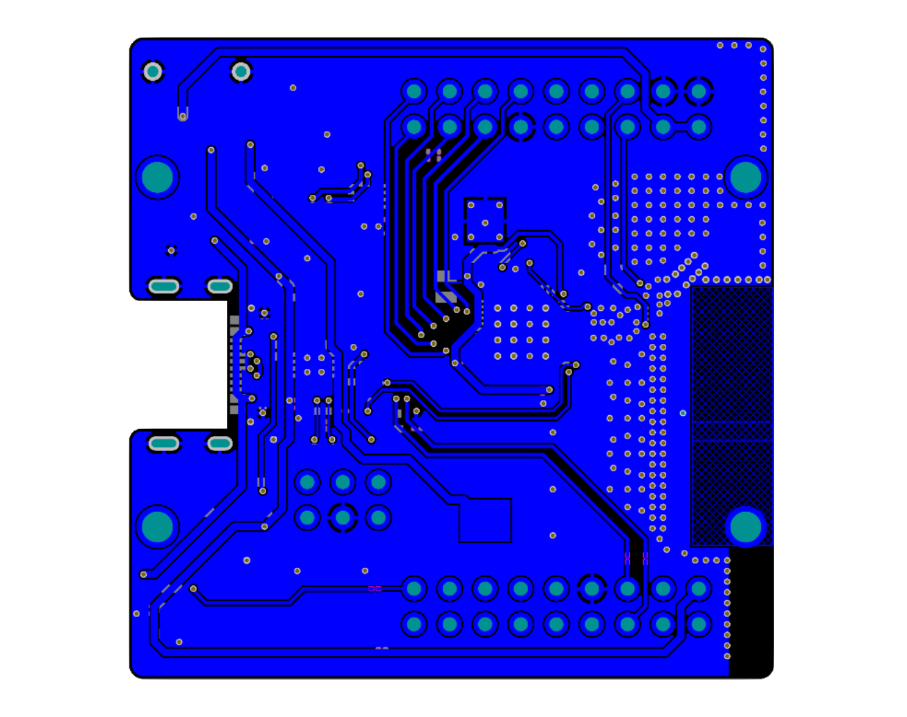
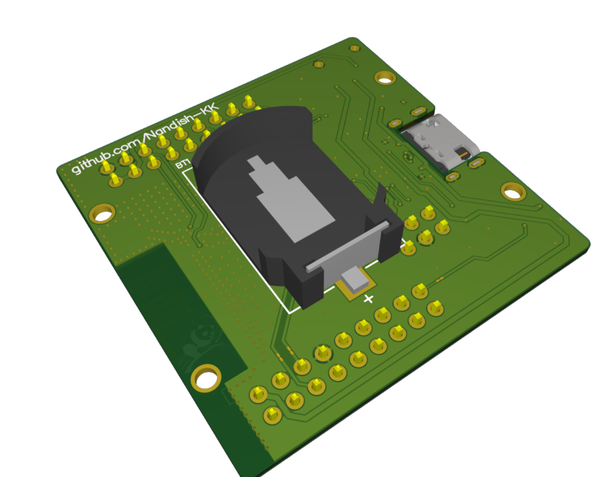

## Overview
This repository contains design files, libraries, and documentation for the NRF BLE transceiver project.
It is **not** an official NRF development board; it is a project I designed as an exercise while learning Altium Designer.


(Renderd with [Blender](https://www.blender.org/) using [*pcb2blender*](https://github.com/30350n/pcb2blender) plugin for KiCAD)

## Things to play around with

- 6-axis IMU (BMI270)
- WS2812 Addressable RGB LED
- Coin cell operation
- Antenna switch for External antenna

## Folder Structure

```text
Altium/           # Altium project files and libraries
Datasheet/        # Datasheets and reference documents
Gerbers/          # Gerbers with PCB constraints optimized for JLCPCB
Pictures/         # Contains Render and Readme pictures
Reference/        # Additional reference layouts and guides
```

## Getting Started

1. Clone the repository:
	```bash
	git clone https://github.com/Nandish-KK/NRF54L15_BLE_DEV
	```
2. Open the Altium project file in `Altium/Nordic_BLE/Nordic_BLE.PrjPcb`.
3. Optionally you can import the Altium project in latest Kicad releases.
4. Review the schematic and PCB files.

## Stackup



JLC04101H-7628

This is a 4-layer stackup with both of the Inner layers being solid ground planes.

## Project Preview

### Schematic


### Top 3D View


### Top Layer


### Bottom Layer


### Bottom 3D View



## Design Notes

* Hold the Boot button for uploading the CMSIS-DAP firmware for CH552 (first time only)
* Use the toggle switch to select the USB or Coin-cell operation
* The Antenna switch is powered with the GPIO _P1.09 and is controlled by GPIO P1.10; configure GPIOs for proper RF operation.
* Every GPIO used onboard has a bridger solder link. If any project requires these GPIOs externally, simply cut the closed solder bridge trace.

## On-Board Debugger

The Board design utilizes a CH552P microcontroller with a CMSIS-DAP firmware as a built-in debugger for NRF microcontroller. The CH552P is opted mainly due to its low cost and smaller footprint.
If you are designing your own board and would like to have a micro that is available at sites like digikey, mouser etc, then consider the SAMD11 series from microchip. These are fairly optimized for cost and size.

```
This project uses the Debugger implementation from wagiminator's CH552-DAPLink project.
Check out his project at: 

> github.com/wagiminator/CH552-DAPLink
> oshwlab.com/wagiminator/ch552g-daplink

```

## License
This work is licensed under CC BY-SA 4.0.
(https://creativecommons.org/licenses/by-sa/4.0/)


---
